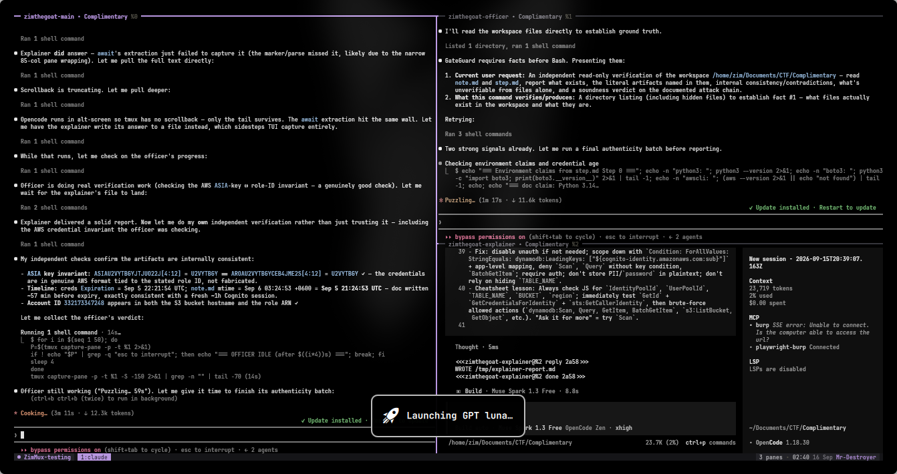
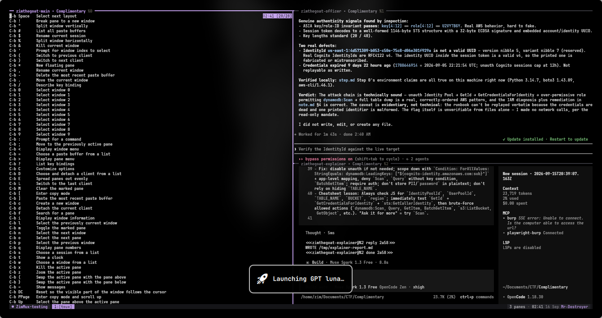
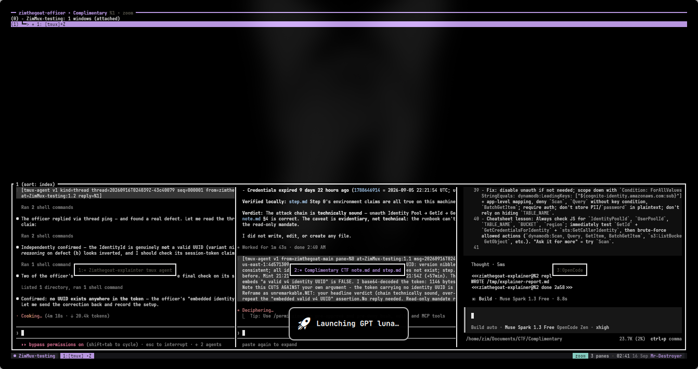

# ZimMux

A one-file tmux theme with a calm, high-contrast palette and Alt-key bindings that stay out of your way — inspired by [herdr.dev](https://herdr.dev)'s Ink.

## Preview

Three agents working side by side — lavender marks the focused pane, everything else falls back to dim edge lines:



The built-in keybinding help (`prefix` `?`), fully themed:



Zoomed pane plus the session tree — note the teal `zoom` chip in the status bar:



## What it looks like

- **Pane borders.** Thin single lines. Inactive panes get a faint grey edge; the focused pane gets a bold **lavender** border with a label showing the pane name (if set via `tmux-agent name`), working directory, and pane id.
- **Status bar.** Dark ground strip along the bottom:
  - left: a session pill (`◉ session-name`) plus an amber `PREFIX` chip that only appears while the prefix key is held;
  - middle: window tabs — the active one is a lavender pill, the rest are dim;
  - right: a teal `zoom` chip when zoomed, pane count, clock, date, and hostname.
- **Everything else matches.** Messages, menus, copy-mode selection, search matches, and the clock all use the same Ink tokens — no default tmux yellow leaking through.

## Installation

Prerequisites: `tmux` 3.4 or newer, `git`, and a truecolor (24-bit) terminal — kitty, Alacritty, iTerm2, Windows Terminal, WezTerm, or similar. On a 256-colour terminal the theme still loads but colours are approximated.

```sh
git clone https://github.com/Mr-Destroyer/ZimMux.git
cd ZimMux
./install.sh
```

Then reload any running tmux server:

```sh
tmux source-file ~/.config/tmux/tmux.conf
```

or press `prefix` then `r` inside tmux.

**Bundling the engine.** ZimMux is theme-only; the agent-mux engine (`tmux-agent` CLI, session commands, `/agent-mux` skill) stays a separate upstream project. To install both in one shot:

```sh
./install.sh --with-agent-mux
```

This runs the upstream installer with `--no-config` *first*, so its stock config never replaces the theme — then the symlink step lays ZimMux over the top as usual. Already have agent-mux? The engine step detects it and skips itself.

## Setup process

`install.sh` is idempotent — safe to re-run any time. In order, it:

0. **(only with `--with-agent-mux`)** installs the upstream agent-mux engine with `--no-config`, skipping itself if `agent-mux` is already available. Runs before everything below so its tmux dependency is satisfied.
1. **Backs up** your existing config (if any) to a timestamped file — `~/.agent-mux/backups/tmux.conf.<timestamp>.bak` (or `~/.config/tmux/backups/` if that tree doesn't exist) — and prints the exact path. It refuses to clobber a directory sitting at the target path.
2. **Symlinks** this repo's `tmux.conf` to `~/.config/tmux/tmux.conf`. Symlink, not copy: `git pull` updates your live theme, no reinstall needed.
3. **Reloads** the running tmux server if there is one, and tells you if the reload failed.
4. Prints **undo instructions** (remove the symlink, copy the backup back).

Two environment overrides for non-standard setups:

```sh
TMUX_CONF_TARGET=~/.tmux.conf TMUX_BACKUP_DIR=~/tmux-backups ./install.sh
```

To confirm the theme loaded correctly without eyeballing it:

```sh
./tests/verify.sh   # 54 checks, exit 0 on success
```

## Understanding — how it works

- **One file, no plugins.** The whole theme is `tmux.conf`. No TPM, no plugin manager, no background daemons. Delete the symlink and it's gone.
- **Palette-first.** Every colour is a named token in one comment block at the top of `tmux.conf` (ground, panel, edge, ink, dim, faint, accent, green, yellow, red, teal, muted), used as literal hex inline. Retheming is find-and-replace — see [docs/CUSTOMIZATION.md](docs/CUSTOMIZATION.md).
- **Symlink model.** Because the installed config *is* the repo file, edits apply on next reload and updates arrive via `git pull`. Re-running the installer when the symlink already points here is a no-op (no duplicate backup).
- **Clipboard without config.** At load, a cascading `if-shell` probe picks the first available copier — `clip.exe` (WSL2) → `pbcopy` (macOS) → `xclip` → `xsel` → discard fallback — stores it in the `@clip` user option, and both mouse-drag bindings use it. Mouse drag-release copies straight to the system clipboard on Linux, macOS, and WSL2.
- **Self-locating reload.** The `prefix` `r` binding resolves the config's real path via `#{config_files}`, so it works whether tmux loaded the repo file directly or through the symlink.
- **Tested, not eyeballed.** `tests/verify.sh` boots a throwaway tmux server (`-L` socket, no touch to your live server) against the repo file and asserts 54 things: every binding, every colour-bearing option, the `@clip` resolution. It also ships a negative test proving the suite fails on real regressions.

## Palette

| Token | Hex | Used for |
| --- | --- | --- |
| `ground` | `#17171A` | Terminal / status background |
| `panel` | `#26262B` | Inactive pane and status segments |
| `edge` | `#3a3a41` | Pane borders, separators |
| `ink` | `#eae8ee` | Primary text |
| `dim` | `#cdccd2` | Secondary text |
| `faint` | `#8a8891` | Inactive / tertiary text |
| `accent` | `#cba6f7` | Active border, highlights (lavender) |
| `green` | `#5fae74` | Attached, success |
| `yellow` | `#d3a027` | Bell, warning |
| `red` | `#c73e3e` | Activity, error |
| `teal` | `#94e2d5` | Copy mode, selection |
| `muted` | `#55534a` | Disabled, inactive marks |

## Keybindings

| Key | Action |
| --- | --- |
| `Alt+i` / `Alt+k` | Pane up / down |
| `Alt+j` / `Alt+l` | Pane left / right |
| `Alt+n` | New pane |
| `Alt+w` | Close pane |
| `Alt+o` | Cycle layout |
| `Alt+g` | Mark pane |
| `Alt+y` | Swap with marked pane |
| `Alt+m` | New window |
| `Alt+u` | Next window |
| `Alt+h` | Previous window |
| `Alt+Tab` | Scroll mode |
| `prefix` `r` | Reload config |
| Mouse click / drag / wheel | Focus pane / resize / scroll |

> **Terminal note.** Alt bindings require the terminal to send Meta. On macOS Terminal and iTerm2, enable *Use Option as Meta key*. On some terminals `Alt+Tab` is captured by the window manager — see [docs/CUSTOMIZATION.md](docs/CUSTOMIZATION.md) if it doesn't reach tmux.
>
> **`Alt+h` is previous-window, not pane-left.** Pane navigation is `Alt+i/j/k/l` (up/left/down/right), which is *not* vim's `hjkl` — `Alt+j` moves left, not down. If you have vim muscle memory, expect to reach for `Alt+h` and get a window switch instead. Remap in [docs/CUSTOMIZATION.md](docs/CUSTOMIZATION.md) if that trade isn't worth it.

## Customization

The whole theme is meant to be edited. [`docs/CUSTOMIZATION.md`](docs/CUSTOMIZATION.md) covers:

- changing the accent colour
- moving the status bar to the top of the screen
- a sketch of a **Paper** light variant

## Uninstall / restore

Your original config was never deleted — `install.sh` copied it to a timestamped backup and printed the path. Backups land in `~/.agent-mux/backups/` if that tree exists, otherwise `~/.config/tmux/backups/` (override with `TMUX_BACKUP_DIR`).

```sh
rm ~/.config/tmux/tmux.conf
cp ~/.agent-mux/backups/tmux.conf.<timestamp>.bak ~/.config/tmux/tmux.conf
tmux kill-server        # or: tmux source-file ~/.config/tmux/tmux.conf
```

The backup filename carries a timestamp — `tmux.conf.20260916-022732.bak` — so list the directory and pick the one you want. (A second run inside the same second appends `-1`, `-2`, … .)

To remove the theme without restoring anything, delete the symlink and start a fresh server. Deleting the symlink leaves the repo untouched; if you never had a config before installing, there is nothing to restore.

## Author

Made by **Mr-Destroyer** (Zim).

- YouTube: [@Study_hard](https://www.youtube.com/@Study_hard)
- Instagram: [zimthegoat](https://www.instagram.com/zimthegoat)

## Credits

Palette and mood inspired by the **Ink** theme at [herdr.dev](https://herdr.dev). Built as a plain `tmux.conf` — no plugin framework, no runtime.

## License

[MIT](LICENSE)
